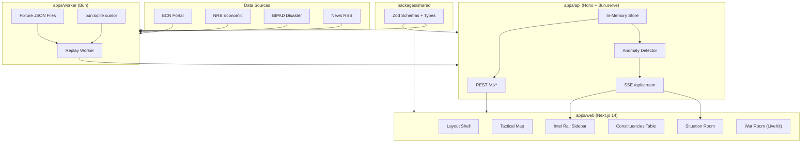

# Nepal Intelligence OS — Phase 1 Implementation Plan

## 1. Monorepo Scaffolding

Fresh Bun workspace monorepo. Root structure:

```
nepal-intelligence-os/
  apps/
    web/          -- Next.js 14 App Router (Bun as pkg manager)
    api/          -- Hono on Bun.serve() (REST + SSE)
    worker/       -- Ingestion workers + replay mode
  packages/
    shared/       -- Zod schemas, types, constants
  data/           -- nepal-districts.geojson, constituency-codes.json
  docker-compose.yml
  README.md
```

Root `package.json` with `"workspaces": ["apps/*", "packages/*"]`. All deps installed via `bun install`. Single `bun.lockb` lockfile.

**Key config files:**

- `turbo.json` or simple bun workspace scripts for `dev`, `build`, `test`
- Root `tsconfig.json` with path aliases; each app extends it
- `.env.example` with `MAPBOX_TOKEN`, `LIVEKIT_URL`, `DATABASE_URL`, `ENABLE_WAR_ROOM`

## 2. Shared Package (`packages/shared`)

Zod schemas that define the entire data model. These are imported by all three apps.

**Core schemas:**

- `Party` — id, name, shortName, color, logoUrl
- `Candidate` — id, name, partyId, constituencyId, photoUrl
- `Constituency` — id, code, name, districtId, provinceId, type (HoR/PA)
- `District` — id, code, name, provinceId, centroid
- `Province` — id, name
- `VoteSnapshot` — constituencyId, candidateId, votes, timestamp, source
- `NationalSummary` — totalSeats, partyResults[], countedConstituencies, timestamp
- `SignalEvent` — id, type (official/ingest/anomaly/note), severity, title, body, timestamp, constituencyId?
- `Anomaly` — id, type (vote_drop/sudden_jump/stale_feed/count_mismatch/duplicate_candidate/missing_constituency), severity, constituencyId, details, timestamp
- `SourceHealth` — sourceId, lastUpdate, errorRate, status (live/stale/error)

Export derived TypeScript types via `z.infer<>`.

## 3. API Server (`apps/api`)

Hono on `Bun.serve()` at port 3001. Lightweight, no Express/Fastify.

**Endpoints:**

- `GET /v1/national-summary` — current seat counts by party
- `GET /v1/constituencies` — list with latest vote data
- `GET /v1/constituencies/:id` — detail + candidate leaderboard
- `GET /v1/districts` — district-level aggregations
- `GET /v1/districts/:id` — single district detail
- `GET /v1/feed` — paginated signal events
- `GET /v1/anomalies` — active anomalies
- `GET /v1/sources/health` — per-source health status
- `GET /api/stream` — **SSE endpoint** pushing snapshots, anomalies, heartbeats (every 30s)

**SSE protocol:**

- Event types: `snapshot`, `anomaly`, `heartbeat`, `event`
- Each message is JSON with a `type` discriminator
- Heartbeat every 30s with server timestamp

**Data layer:** Start with in-memory store (Map-based) seeded from fixtures. PostgreSQL integration is a follow-up (not blocking Phase 1 launch). This keeps initial setup fast.

## 4. Worker + Replay Mode (`apps/worker`)

**Fixtures** (hand-crafted JSON files under `apps/worker/fixtures/`):

- `national_summary.json` — evolving seat counts
- `district_results.json` — per-district aggregates
- `constituency_results.json` — 20+ constituencies with candidate-level data
- `event_feed.json` — 50+ signal events spanning a simulated 4-hour election night

**Replay worker:**

- Reads fixture events in chronological order
- POSTs to `apps/api` ingestion endpoint at configurable speed (1x / 5x / 10x via `REPLAY_SPEED` env)
- Uses `bun:sqlite` to persist replay cursor position (resume after restart)
- Publishes SSE events through the API's broadcast channel

**Anomaly detector v1:**

- Runs inside `apps/api` on each incoming snapshot
- Checks: vote drop, sudden jump (>30% delta), stale feed (no update >10min), count mismatch
- Emits anomaly events on the SSE stream

## 5. Frontend (`apps/web`) — Next.js 14 App Router

### 5a. Foundation Layer

- `bun create next-app` with App Router, TypeScript, Tailwind, `src/` directory
- Install and configure shadcn/ui (dark mode only, CSS variables theme)
- Custom theme matching the design language:
  - Background: `#08090c`, surface: `#0e1017`, border: `rgba(255,255,255,0.07)`
  - Accent: Nepal red `#dc143c`, purple `#8b5cf6`, green `#10b981`
  - Fonts: Syne (headings) + JetBrains Mono (data/body)
- Zustand store: `useFilterStore` (active module, selected province/district, time range, diff mode toggle)
- TanStack Query provider with SSR hydration

### 5b. Global Layout Shell

```
TopBar:  [⌘K] [Module Selector] [Filters] [● LIVE indicator] [UTC+5:45 clock]
─────────────────────────────────────────────────────────────────────────────
NavRail  │  Main Content Area (children)           │  Intel Rail (sidebar)
(left)   │                                         │  - SSE status
         │                                         │  - Top 5 anomalies
         │                                         │  - Watchlist + sparklines
         │                                         │  - Source health
         │                                         │  - Notes scratchpad
─────────────────────────────────────────────────────────────────────────────
Ticker:  [auto-scrolling last 20 events with pause button]
```

- **NavRail:** icon + label links for each route (/, /map, /constituencies, /parliament, /feed, /economy, /disasters, /war-room)
- **Intel Rail:** collapsible right sidebar, always visible by default. Five sections as listed above. SSE connection indicator with color logic: green (<60s), amber (60-300s), red (>300s)
- **Ticker:** horizontal auto-scrolling bar at bottom, last 20 signal events, pause-on-hover
- **Command Palette (⌘K):** using `cmdk` library — jump to district/constituency, toggle map layers, switch module, trigger diff mode

### 5c. SSE Client Hook

`useSSE()` custom hook:

- Connects to `/api/stream` via `EventSource`
- On `snapshot` event: invalidates relevant TanStack Query keys
- On `anomaly` event: pushes to Zustand anomaly store + triggers Intel Rail update
- On `heartbeat`: updates connection age tracker
- Auto-reconnect with exponential backoff
- Exposes `connectionStatus: 'live' | 'stale' | 'error'`

### 5d. Core Pages

`**/` — Situation Room**

- National summary cards: total seats counted, leading party, turnout estimate
- Mini choropleth map (province-level, click to expand)
- Live signals ticker (last 10 events)
- "What Changed in Last 10 Minutes" AI card:
  - Client-side diff: compare latest snapshot vs snapshot from 10 min ago
  - Show top 5 largest margin deltas
  - Auto-refresh every 60s
  - Click item to navigate to constituency
- Top battle seats widget (closest margins)

`**/map` — Nepal Tactical Map**

- Full-screen Mapbox GL JS choropleth
- GeoJSON layers: districts (77), provinces (7), constituencies (165 HoR)
- Color by: leading party, margin intensity, turnout, anomaly density
- Toggle layers via ⌘K or layer control panel
- Click district/constituency to open a **dossier drawer** (slide-in from right)
- Time scrubber for historical playback (if replay data available)
- Anomaly pins on map (pulsing red dots)
- Hover tooltips: name, leading candidate, margin, last update time

`**/constituencies` — Data Table**

- TanStack Table with: constituency name, district, province, leading candidate, party, margin, vote count, status, last update
- Saved views as tabs: "All", "Closest Races", "Most Volatile", "Stale Feeds"
- Column visibility toggles
- Click row to navigate to `/constituencies/[id]`
- Search/filter by name, district, party

`**/constituencies/[id]` — Constituency Dossier**

- Candidate leaderboard (bar chart + table)
- Vote trend chart (Recharts line chart over time)
- Audit panel: raw snapshot payloads, before/after diff viewer
- Anomaly log for this constituency
- Back navigation to table

`**/parliament` — Seat Control**

- Seat tiles grid colored by party
- Majority threshold line (138 for HoR)
- Seat flip log (real-time as results come in)
- Coalition builder (hypothetical coalitions)
- Party seat count bar chart

`**/feed` — Signals Feed**

- Vertical timeline/newsroom feed
- Event types: official (blue), ingest (gray), anomaly (red), note (yellow)
- Severity filters
- Pin event to Intel Rail watchlist
- Expandable detail view per event
- Infinite scroll with TanStack Query pagination

`**/economy`, `/disasters`** — Stub pages with "Coming in Phase 2" placeholder and module description.

`**/war-room`** — Gated behind `ENABLE_WAR_ROOM=true` env var:

- LiveKit React room (voice + optional video)
- Push-to-talk mode
- AI briefing panel (static card initially, wired to data in Phase 2)
- Shared map annotation canvas (stub)

## 6. Data Assets (`data/`)

- `nepal-districts.geojson` — all 77 districts with boundaries (sourced from open Nepal geodata)
- `nepal-provinces.geojson` — 7 province boundaries
- `constituency-codes.json` — mapping of constituency IDs to names, districts, provinces
- `district_code_map.json` — district code to name mapping

These are static files loaded by the map component and used for lookups.

## 7. Deployment

`**docker-compose.yml`** with services:

- `web` — Next.js (node:20-alpine runtime, Bun for install)
- `api` — Hono on Bun (`oven/bun:1` image)
- `worker` — Replay worker on Bun (`oven/bun:1` image)
- `redis` — Upstash-compatible Redis (for future SSE pub/sub fan-out)
- `caddy` — Reverse proxy with automatic HTTPS

Each app gets its own Dockerfile. Environment variables via `.env` file.

`**README.md`** with: project overview, architecture diagram (mermaid), setup instructions (`bun install`, `bun run dev`), env var reference, deployment guide.

## 8. Design Principles for Implementation

- **Dark mode only** — no light mode toggle needed
- **Tabular numbers** for all vote counts (`font-variant-numeric: tabular-nums`)
- **Border-first UI** — use borders for separation, not shadows
- **Status indicators everywhere** — green/amber/red dots for liveness
- **"Superintelligence console" aesthetic** — dense data, monospace numbers, minimal whitespace waste
- **Responsive but desktop-first** — primary audience is analysts on large screens

## Architecture Diagram




